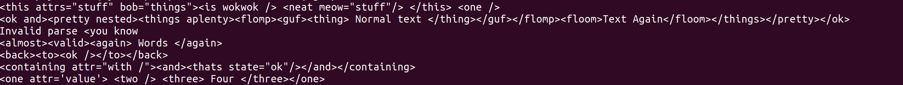
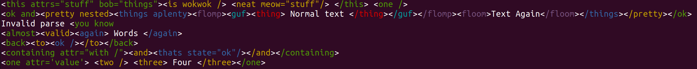

This is a really simple thing, meant to be used in a pipeline.
It takes each line, and colourizes things it thinks look like XML.

So, it turns:

into this:

It's line-based, because I'm using it for log-file streaming, and so I don't want anything on one line to affect the next line.

Also, it doesn't parse or format at all, it just adds colour to things that look like XML, so that I can more easily scan it with my eyes and suss out the nesting myself when I'm looking for something.

